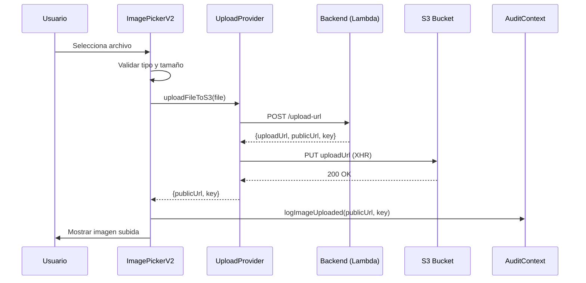

# Dashboard E-commerce - Admin Panel

Sistema de administración completo para e-commerce estilo Shopify-lite con subida de imágenes a S3, RBAC, auditoría y gestión de productos con variantes.

## 🚀 Características Principales

### ✅ Gestión de Productos
- CRUD completo de productos
- Variantes (talla/color) con inventario independiente
- Validación global de SKUs únicos
- Búsqueda y filtrado avanzado
- Export CSV con variantes
- Estados: Draft, Active, Paused, Out of Stock

### ✅ Sistema de Imágenes (Nuevo)
- **Subida real a S3 con URLs firmadas**
- Drag & Drop + File Picker
- Validación: JPEG, PNG, WebP (max 5MB)
- Progreso individual por archivo
- Hasta 6 imágenes por producto
- Marcado de imagen principal

### ✅ Gestión de Categorías
- CRUD completo de categorías
- Migración automática de productos
- Filtrado dinámico

### ✅ RBAC (Control de Acceso)
- 5 roles: SUPER_ADMIN, ADMIN, CATALOG, OPS, VIEWER
- Permisos atómicos granulares
- Guards de UI y routing
- Modo "stock-only" para OPS

### ✅ Auditoría
- Registro completo de acciones
- Persistencia en localStorage
- Eventos de productos, categorías e imágenes
- Filtrado por actor, acción y entidad

## 📦 Instalación

```bash
# Instalar dependencias
pnpm install

# Desarrollo
pnpm dev

# Build
pnpm build
```

## 🔧 Configuración

### Variables de Entorno

Crea un archivo `.env` en la raíz:

```bash
# Sistema de Upload a S3
VITE_PRESIGN_ENDPOINT=https://bqpimqkhkl.execute-api.us-east-1.amazonaws.com/dev/vehicles/upload-url
VITE_UPLOAD_FOLDER=products

# (Opcional) URL base de S3
# VITE_S3_BASE_URL=https://your-bucket.s3.amazonaws.com
```

### Backend (AWS)

El sistema requiere:
1. **Lambda/API Gateway** para generar URLs firmadas
2. **S3 Bucket** con CORS configurado
3. **IAM Role** con permisos de s3:PutObject

Ver [DEPLOYMENT.md](./DEPLOYMENT.md) para detalles completos.

## 📚 Documentación

- **[UPLOAD_SYSTEM.md](./UPLOAD_SYSTEM.md)** - Sistema completo de subida de imágenes
- **[DEPLOYMENT.md](./DEPLOYMENT.md)** - Guía de deploy en Vercel y AWS
- **[USAGE_EXAMPLES.md](./USAGE_EXAMPLES.md)** - Ejemplos de código
- **[PRE_DEPLOY_CHECKLIST.md](./PRE_DEPLOY_CHECKLIST.md)** - Checklist de verificación
- **[IMPLEMENTATION_SUMMARY.md](./IMPLEMENTATION_SUMMARY.md)** - Resumen de implementación

## 🏗️ Arquitectura

```
src/
├── app/
│   ├── components/
│   │   ├── ImagePickerV2.tsx       # Componente de subida de imágenes ⭐
│   │   ├── ProductForm.tsx
│   │   ├── CategoryForm.tsx
│   │   └── ...
│   ├── pages/
│   │   ├── Products.tsx
│   │   ├── ProductFormNew.tsx      # Usa ImagePickerV2 ⭐
│   │   ├── Categories.tsx
│   │   └── Audit.tsx
│   ├── services/
│   │   └── uploadProvider.ts       # Servicio de upload a S3 ⭐
│   ├── store/
│   │   ├── AuthContext.tsx         # RBAC
│   │   ├── AuditContext.tsx        # Auditoría ⭐
│   │   ├── ProductsContext.tsx
│   │   └── CategoryContext.tsx
│   ├── types/
│   │   ├── upload.ts               # Types de upload ⭐
│   │   ├── audit.ts                # Types de auditoría ⭐
│   │   └── permissions.ts
│   └── utils/
│       ├── validation.ts
│       └── csvExport.ts
└── styles/
```

## 🎯 Sistema de Permisos

| Rol | Productos | Inventario | Imágenes | Categorías | Configuración |
|-----|-----------|------------|----------|------------|---------------|
| SUPER_ADMIN | ✅ Full | ✅ Full | ✅ Upload | ✅ Full | ✅ Full |
| ADMIN | ✅ Full | ✅ Full | ✅ Upload | ✅ Full | ✅ Read |
| CATALOG | ✅ CRUD | ❌ | ✅ Upload | ✅ CRUD | ❌ |
| OPS | ✅ Read | ✅ Update | ❌ | ✅ Read | ❌ |
| VIEWER | ✅ Read | ❌ | ❌ | ✅ Read | ❌ |

## 🔄 Flujo de Subida de Imágenes



## 🧪 Testing

### Test Rápido
```bash
# 1. Inicia el servidor de desarrollo
pnpm dev

# 2. Abre http://localhost:5173

# 3. Ve a Productos → Nuevo Producto

# 4. Arrastra una imagen al área de upload

# 5. Verifica que se suba a S3 y aparezca en el preview
```

### Test de Permisos
```bash
# 1. Cambia el rol en el header (selector de rol)

# 2. Con rol OPS:
#    - Intenta editar un producto
#    - Verifica que solo puedas cambiar el stock
#    - Verifica que las imágenes sean solo lectura

# 3. Con rol CATALOG:
#    - Verifica que puedas subir imágenes
#    - Verifica que puedas crear productos
```

## 🚀 Deploy en Vercel

```bash
# 1. Instala Vercel CLI
npm i -g vercel

# 2. Login
vercel login

# 3. Deploy
vercel

# 4. Configura variables de entorno en Vercel Dashboard
# Settings → Environment Variables

# 5. Deploy a producción
vercel --prod
```

Ver [DEPLOYMENT.md](./DEPLOYMENT.md) para instrucciones completas.

## 🐛 Troubleshooting

### "Presign request failed"
- Verifica que `VITE_PRESIGN_ENDPOINT` esté configurado correctamente
- Verifica que el endpoint de Lambda esté deployado
- Revisa los logs de CloudWatch

### "CORS error"
- Verifica la configuración CORS del bucket S3
- Agrega tu dominio a `AllowedOrigins`

### "403 Forbidden" al subir
- Verifica los permisos IAM del rol de Lambda
- Verifica que la URL firmada no haya expirado

### Las imágenes no se cargan
- Verifica que el bucket sea público o tenga CloudFront
- Verifica que `publicUrl` devuelta por el backend sea correcta

Ver [PRE_DEPLOY_CHECKLIST.md](./PRE_DEPLOY_CHECKLIST.md) para más detalles.

## 📊 Tecnologías

- **Frontend:** React 18 + TypeScript
- **Routing:** React Router v7
- **Styling:** Tailwind CSS v4
- **UI Components:** Radix UI + custom components
- **Icons:** Lucide React
- **Build:** Vite
- **Deploy:** Vercel
- **Backend:** AWS Lambda + API Gateway
- **Storage:** AWS S3

## 🔐 Seguridad

- ✅ Validación de archivos en frontend y backend
- ✅ URLs firmadas con expiración
- ✅ RBAC con permisos granulares
- ✅ Auditoría completa de acciones
- ✅ Sin API keys hardcodeadas
- ✅ Variables de entorno seguras

## 📈 Performance

- Upload con progreso en tiempo real (XMLHttpRequest)
- Sin bloqueo de UI durante upload
- Subidas paralelas soportadas
- Lazy loading de imágenes
- Optimización de bundle con Vite

## 🤝 Contribuir

1. Fork el proyecto
2. Crea una rama (`git checkout -b feature/AmazingFeature`)
3. Commit tus cambios (`git commit -m 'Add some AmazingFeature'`)
4. Push a la rama (`git push origin feature/AmazingFeature`)
5. Abre un Pull Request

## 📝 Roadmap

### Completado ✅
- [x] CRUD de productos
- [x] Sistema de variantes
- [x] RBAC completo
- [x] Auditoría local
- [x] Gestión de categorías
- [x] Subida real de imágenes a S3
- [x] Validación y permisos

### Próximos Pasos 🔄
- [ ] Compresión de imágenes antes de subir
- [ ] Edición/recorte de imágenes
- [ ] Biblioteca de medios compartida
- [ ] Soporte para videos
- [ ] Backend real (API)
- [ ] Base de datos (PostgreSQL/MongoDB)
- [ ] Autenticación real (Auth0/Clerk)
- [ ] Notificaciones push
- [ ] Analytics avanzado

## 📄 Licencia

Este es un proyecto de demostración. Todos los derechos reservados.

## 📞 Soporte

Para preguntas o problemas:
1. Revisa la documentación en `/docs`
2. Busca en issues existentes
3. Crea un nuevo issue con detalles completos

---

**Última actualización:** 2026-02-05

**Estado:** ✅ Listo para producción

**Versión:** 2.0.0 (con sistema de upload a S3)
